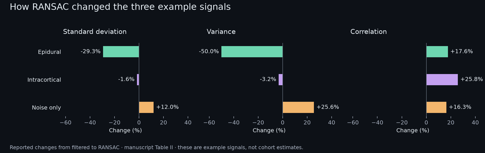
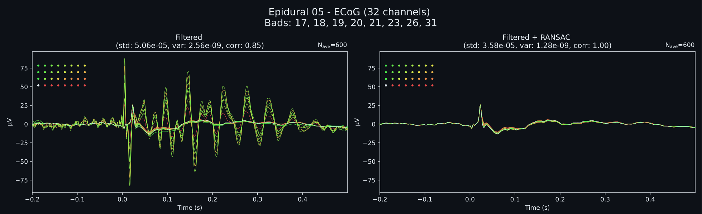
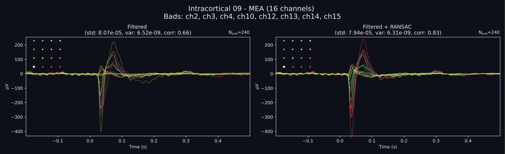

# Signal Reconstruction with RANSAC

Research on bad-channel detection and interpolation in high-density epidural micro-ECoG and intracortical microelectrode-array recordings. The study examines how RANSAC's spatial assumptions affect reconstructed signals, and how its behaviour changes between surface and penetrating electrode arrays.

**Completed research project · IEEE EMBC 2025**

## Publication

**Strengths & Weaknesses of RANSAC applied to Epidural & Intracortical Recordings**

Nickolaj Ajay Atchuthan, Felipe Rettore Andreis, Winnie Jensen, and Suzan Meijs.

[Published paper](https://doi.org/10.1109/EMBC58623.2025.11252752)

## What the study found

The work compared an epidural signal, an intracortical signal, and a noise-only example from experiments in anaesthetised animals. It used MNE and autoreject to examine changes in waveforms, spatial maps, variance, and reconstruction correlation.

- Tuned RANSAC settings improved the epidural example by detecting and interpolating faulty channels.
- The same settings could attenuate legitimate intracortical features. Default settings had only modest effects on the intracortical example.
- The noise-only example also became more correlated after interpolation. Higher correlation alone therefore did not demonstrate successful signal reconstruction.



*Values from Table II of the supplied manuscript. These describe the illustrated examples, not estimates of performance across a cohort.*

## Examples from the manuscript



*Epidural example from Figure 2a: filtered responses on the left and filtered + RANSAC on the right.*



*Intracortical example from Figure 2b, using default parameters. These previews retain the original traces, axes, units, and sample counts, with colours adapted for a dark background. The lower diagnostic heatmaps are omitted from the previews; the [original figure PDFs and provenance](docs/figures/) are retained.*

The main conclusion is that RANSAC needs modality-specific evaluation. Local activity in penetrating arrays can violate assumptions that are useful for more spatially correlated surface recordings. Signal preservation needs to be checked alongside noise reduction.

## Analysis code

| Path | Role |
| --- | --- |
| `research/ransac_comparison.py` | Portable comparison helper using the manuscript's parameter table |
| `preprocessing_ECoG/` | Historical preprocessing, RANSAC comparisons, and spatial mapping |
| `preprocessing_MEA/bad_channel_detection/` | Intracortical RANSAC and channel-quality experiments |
| `general/` | Recording-loading helpers |
| `docs/figures/` | Manuscript figures, reported values, and provenance |

The helper accepts already preprocessed MNE epochs with a reviewed electrode montage. It applies no implicit filtering, rescaling, or channel remapping. The `epidural-paper` preset uses 7 resamples, a 0.125 channel fraction, 0.85 correlation threshold, and 0.4 bad-epoch fraction, as listed in Table I. The `default` preset retains the paper's default settings.

```sh
python -m pip install -r requirements.txt
python -m research.ransac_comparison --help
python -m research.ransac_comparison recordings-epo.fif --preset epidural-paper --output outputs/comparison
python -m unittest discover -s tests -v
```

The original scripts preserve their run-specific paths and settings, including some 50-resample exploratory comparisons. The helper makes the paper's settings explicit; it does not recreate the original preprocessing or reproduce the publication without its recordings and montages. Tests use synthetic inputs. Raw recordings are not included.
